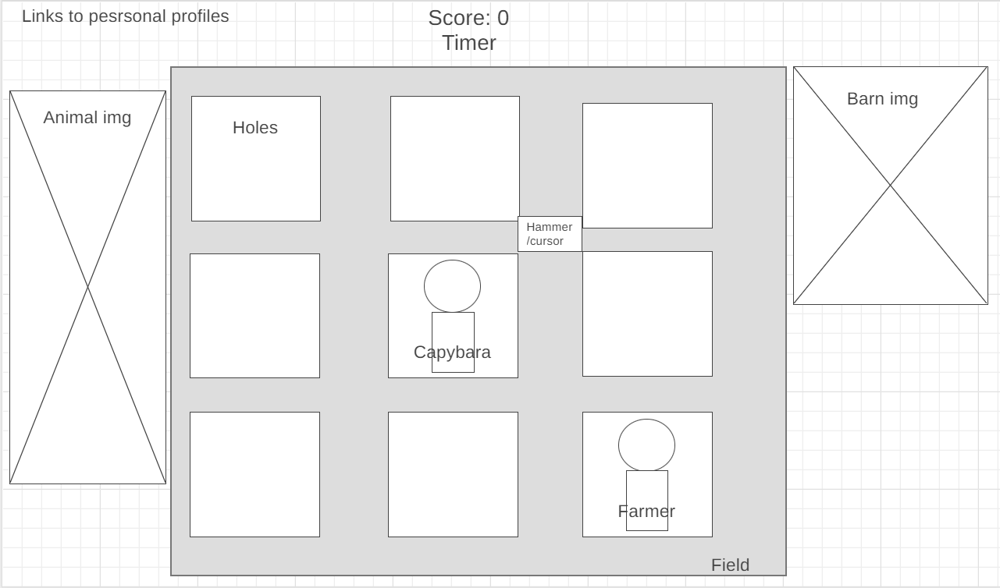

Introduction to Whack-A-Bara:
    An introduction to the game will be given by a farmer character who is in need of assistance. Capybaras are eating all his vegetables and he needs help diriving them away. The objective of the game is to hit as many capybaras as a player can. 
    
    Capybara images will appear and disappear out of many holes. A player must move their hammer (cursor) and click on the capybaras to whack them before they hide back into their hole. Any capybara successfully hit will increase the player's score, which will be displayed at the top. However, the farmer is underground as well to 'make the capybaras pop out.' If a user hits the farmer, then the game is over. A timer will also be added as another condition for the game to end. 

In Whack-A-Bara, users will be able to:

* Move around and click with a cursor that has been shaped like a hammer and will animate movement on click
* Click on capybaras to simulate a hit, which will push the capybara back down the hole and increase the user's total score
* Click on the farmer, which will immediately end the game 

In addition, the project will include:

* An introduction/instructions given to the user at the start of a game
* A timer that will end the game once reaching 0:00
* A running total of the player's score

Whack-A-Bara will be constucted using HTML, CSS, JavaScript, and Canvas. Please see the image below for a wireframe layout of the game.

Timeline:

* Friday Afternoon & Weekend: Research and creation of functionality of the game. This will incude creating methods for creating the game grid, movement of the capybaras, and the interaction with a mouse click.

* Monday: Creation of the canvas, uploading images of the characters, and adding additional background aesthetics, editing styling.

* Tuesday: Adding non-functionality aspects of the game. This will include adding a timer, a score, and creating a hammer cursor for the user, and an instructions pop-up for users.

* Wednesday: Full game testing with Tuesday's added features. Ensuring images, animation, and styling look smooth with game all game functionality.

* Thursday Morning: Final Review and submission.